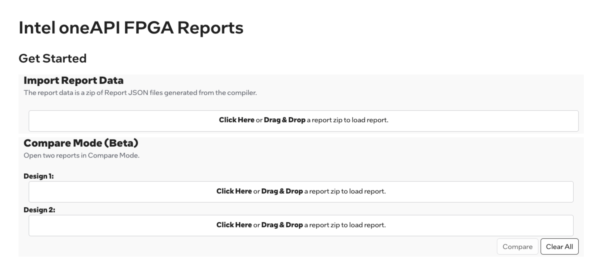
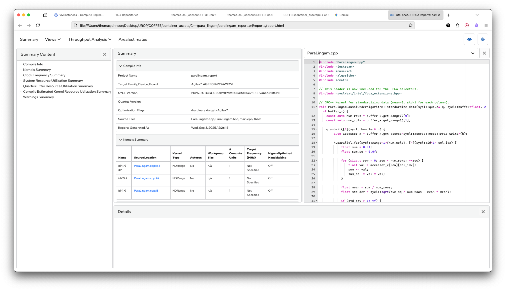

# Project Notes

## Direct Lingam

TODO: fill in information

## Para Lingam

### Setup

```bash
# For FPGA Emulation
icpx -fintelfpga -DFPGA_EMULATOR main.cpp ParaLingam.cpp -o paralingam_emu
./paralingam_emu
# Running Parallelised ParaLiNGAM Algorithm in DPC++...
# Running on device: Intel(R) FPGA Emulation Device
# Causal Order: [ 1 2 5 4 3 0 ]
# Execution Time: 1.35867 seconds

# For Report
icpx -fintelfpga -DFPGA_HARDWARE main.cpp ParaLingam.cpp -Xshardware -fsycl-link=early -Xstarget=Agilex7 -o paralingam_report.a
# Segmentation fault (core dumped)
# Compiler Warning: Limiting maximum work-group size to 512 in function const_lambda_2(...) to support private memory.
# aoc: Warning RAM Utilization is at 120%!
```

### How to Read Optimisation Reports

Developers can:
* Identify any memory, performance, data-flow
bottlenecks in their design.
* Receive suggestions for optimization techniques to
resolve said bottlenecks.
* Understand the implementation scheduling of the
hardware built by the compiler
* Get area and timing estimates of their designs for the
desired FPGA.

Open the FPGA report landing page:
```text
open file:///Users/thomasjohnson/Desktop/UROP/COFFEE/container_assets/Project/reports/html_report/report.html
```

Landing page of report comparisons:


Landing page of specific report:


#### Loop Analysis

1. Click Throughput Analysis > Loop Analysis. 
2. The Loop Analysis report helps you examine kernel throughput. We can see performance indicators (such as II) and potential performance bottlenecks.
3. For each loop, you can identify the following using the report:
    - Whether the loop is pipelined
    - Whether the loop uses a hyper-optimised loop structure
    - Any pragma or attribute applied to the loop
    - Initiation Interval (II) of the loop
4. The left-hand Loops List pane of the Loop Analysis report displays the following types of loops the compiler detects in your design and indicates any transformations the compiler may have applied. These transformations may be applied automatically or due to a source-code annotation, such as a pragma or an attribute.
    - Fused loops (see Fuse Loops to Reduce Overhead and Improve Performance)
    - Fused subloops
    - Coalesced loops
    - Fully unrolled loops
    - Partially unrolled loops

#### Key Performance Metrics
The Loop Analysis report captures the following key performance metrics on all blocks:
* **Source Location**: Indicates the loop location in the source code.
* **Pipelined**: Indicates whether a loop is pipelined. Pipelining allows for many data items to be processed concurrently (in the same clock cycle) while efficiently using of the hardware in the datapath by keeping it occupied.
* **II**: Shows the sustainable initiation interval (II) of the loop. Processing data in loops is an additional source of pipeline parallelism. When you pipeline a loop, the next iteration of the loop begins before previous iterations complete. You can determine the number of clock cycles between iterations by the number of clock cycles you require to resolve any dependencies between iterations. You can refer to this number as the initiation interval (II) of the loop. The Intel® oneAPI DPC++/C++ Compiler automatically identifies these dependencies and builds hardware to resolve these dependencies while minimizing the II.
* **Estimated fMAX**: Shows the estimated maximum clock frequency at which the loop operates. You can also reference it as "Scheduled fMAX." The fMAX is the maximum rate at which the outputs of registers are updated. If the estimated fMAX is below the target frequency, then the estimated fMAX appears in red color and a question mark with a tooltip displaying the target frequency displays. The physical propagation delay of the signal between two consecutive registers limits the clock speed. This propagation delay is a function of the complexity of the Boolean logic in the path. The path with the most logic (and the highest delay) limits the speed of the entire circuit, and you can refer to this path as the critical path. The fMAX is calculated as the inverse of the critical path delay. High fMAX is desirable because it correlates directly with high performance in the absence of other bottlenecks. The compiler attempts to optimize for different objectives for the estimated fMAX depending on whether the fMAX target is set and whether the #pragma II is set for each of the loops. The fMAX target is a strong suggestion, and the compiler does not error out if it cannot achieve this fMAX, whereas the #pragma II triggers an error if the compiler is not able to achieve the requested II. The fMAX achieved for each block of code is shown in the Loop Analysis report. This behavior is outlined in the following table. 
* **Latency**: Shows the number of clock cycles a loop takes to complete one or more instructions. Typically, you want to have low latency. However, lowering latency often results in decreased fMAX.
* **Speculated Iterations**: Shows the loop speculation. Loop speculation is an optimization technique that enables more efficient loop pipelining by allowing future iterations to be initiated before determining whether the loop was exited already.
* **Max Interleaving Iterations**: Indicates the number of interleaved invocations of an inner loop that can be executed simultaneously. For more information, refer to max_interleaving Attribute.

### Records

#### Round 1


* fMax 480
* Pipelined - Loops are not pipelined
* Latency - 85, 97, 98, 102
* No bottlenecks


* Area use - 


### Resources

[Intel OneAPI FPGA Handbook : Website](https://www.intel.com/content/www/us/en/docs/oneapi-fpga-add-on/developer-guide/2024-0/intel-oneapi-fpga-handbook.html)

[Intel OneAPI FPGA Handbook : pdf](https://cdrdv2-public.intel.com/785442/oneapi-fpga-add-on_developer-guide_2024.0-785441-785442.pdf)

[Intel OneAPI Programming Handbook : Website](https://www.intel.com/content/www/us/en/docs/oneapi/programming-guide/2023-0/overview.html)

[Intel OneAPI FPGA ppt: pdf](https://indico.cern.ch/event/1033028/contributions/4551823/attachments/2340355/3989889/oneAPI-FPGA-HEP.pdf)

[Data Parallel C++ : pdf](https://link.springer.com/book/10.1007/978-1-4842-5574-2)

[OneAPI ppt : pdf](https://tobiasweinzierl.webspace.durham.ac.uk/wp-content/uploads/sites/288/2023/03/Intel-OneAPI-2023-CSE.pdf)


